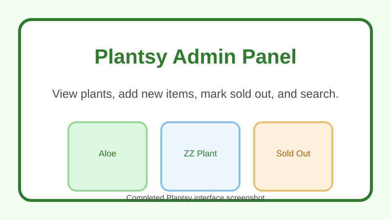

# Plantsy Plant Shop

## Overview

Plantsy is a React admin interface connected to a JSON server backend. The app:

- loads all plants on page load,
- lets you add a new plant via a form,
- toggles plant stock status to "sold out",
- filters plant listings as you type in search.

## Screenshot



## Setup

1. Run `npm install`.
2. Start the backend server: `npm run server`.
3. In a separate terminal, start the frontend: `npm run dev`.
4. Open the app in your browser at the `vite` URL shown in the terminal.

## Testing

Run the test suite with:

```bash
npm run test
```

## Features

- `GET /plants`: fetches plant data on startup and renders it in the UI.
- `POST /plants`: adds a new plant to the backend and displays it immediately.
- Search: filters visible plants by name using a case-insensitive string match.
- Stock toggle: marks each plant card as `In Stock` or `Out of Stock`.

## Backend

The backend is served by `json-server` on port `6001`.

- Base URL: `http://localhost:6001`
- Plants endpoint: `http://localhost:6001/plants`

## Notes

- The app uses React state and effects to keep the frontend in sync with backend data.
- The search input is controlled, so clearing the query restores the full list.
- Plant cards maintain their own stock state and update the button label when toggled.
